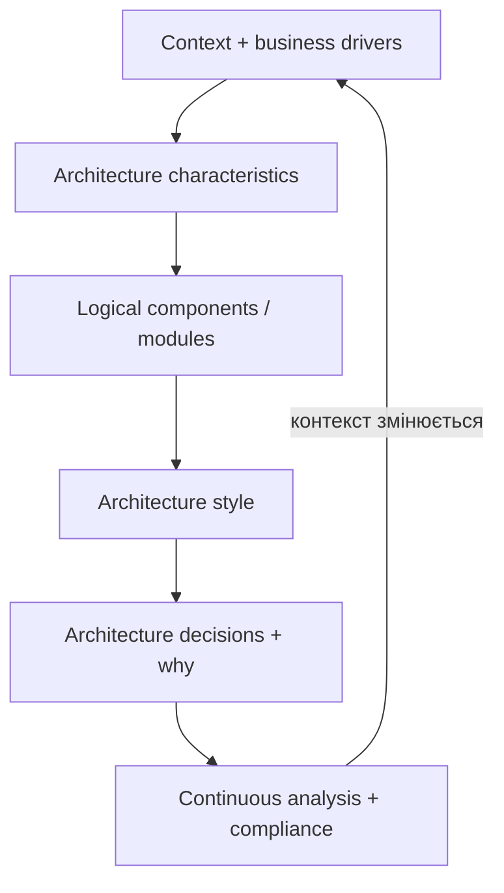

# Fundamentals of Software Architecture - Chapters 1-3

> [!abstract] Мета
> Карта матеріалу про визначення software architecture, спосіб мислення архітектора та структурну якість модулів.

Джерело: [[dokumen_pub_fundamentals_of_software_architecture_a_modern_engineering.pdf]]  

Конспект доповнено навчальними прикладами: вони пояснюють ідеї книги, але не є її цитатами. Англомовні цитати й номери оригінальних figures позначено окремо; числа в розрахунках та прикладах вимог умовні.

## Навігація

1. [[01 - Introduction|Chapter 1 - Introduction]]
   - чотири виміри software architecture;
   - три закони архітектури;
   - вісім очікувань від архітектора.
2. [[02 - Architectural Thinking|Chapter 2 - Architectural Thinking]]
   - architecture vs design;
   - technical breadth;
   - trade-off analysis;
   - hands-on coding без Bottleneck Trap.
3. [[03 - Modularity|Chapter 3 - Modularity]]
   - modularity vs granularity;
   - cohesion і LCOM;
   - coupling metrics;
   - connascence.
4. [[04 - Glossary and Formulas|Glossary and Formulas]]
   - терміни для повторення;
   - покрокові розрахунки `A`, `I`, `D` та `LCOM1`;
   - короткий checklist.

## Загальна картина

## Три тези, які тримають усе разом

> "Everything in software architecture is a trade-off."

> "Why is more important than how."

> "Most architecture decisions aren't binary but rather exist on a spectrum between extremes."

Архітектор працює не з універсальними відповідями, а з **context**, **constraints**, альтернативами та наслідками.

## Рекомендований спосіб вивчення

Для практичного проходу: [[01 - Introduction#Приклад: сервіс продажу квитків|від бізнесу до архітектури]] → [[02 - Architectural Thinking#Приклад: messaging topic vs queues|вибір способу взаємодії]] → [[03 - Modularity#Приклади, за якими легко впізнати connascence|залежності в коді]] → [[04 - Glossary and Formulas#Крайові випадки та коротка вправа|розрахунок метрик самостійно]].

- Прочитай Chapter 1, щоб сформувати ментальну модель ролі.
- У Chapter 2 тренуй питання: *що ми виграємо і чим платимо?*
- У Chapter 3 пов'язуй кожен термін зі своїм кодом або поточним проєктом.
- Після кожної глави відповідай на блок **Самоперевірка** без підглядання.
