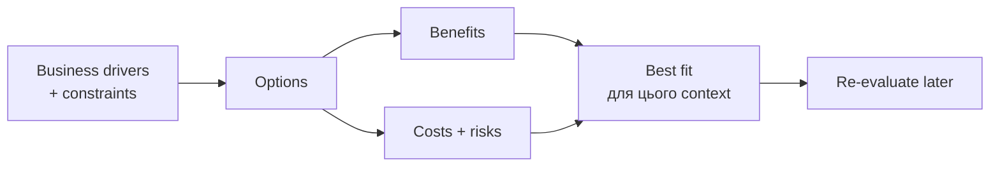
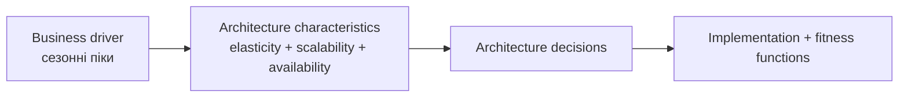

# Chapter 2 - Architectural Thinking

← [[01 - Introduction|← Chapter 1]] | [[00 - Index|Index]] | [[03 - Modularity|Chapter 3 →]]

> [!summary] Суть
> Architectural thinking - це здатність бачити системний і довгостроковий вплив рішення, знати альтернативи та явно порівнювати їхні benefits, costs і risks у конкретному контексті.

Джерело: [[dokumen_pub_fundamentals_of_software_architecture_a_modern_engineering.pdf]], сторінки книги 17-36.

## Architecture vs Design

Між ними немає жорсткої межі - це spectrum:

![[Assets/FOSA/architecture-vs-design.svg]]

*Перемальовано за Figure 2-1: що стратегічніше, дорожче для зміни та насиченіше trade-offs, то ближче рішення до architecture.*

Для оцінки рішення запитай:

1. Воно **strategic** чи **tactical**?
2. Скільки **effort** потребує реалізація або зміна?
3. Наскільки значними є **trade-offs**?

Перехід із layered monolith на microservices - ближче до architecture. Перестановка полів на UI - ближче до design.

## Technical breadth

Developer переважно розвиває **depth** у конкретних technologies. Architect має підтримувати достатню depth, але головна цінність - **breadth**, тобто знання багатьох класів рішень та їхніх trade-offs.

![[Assets/FOSA/knowledge-pyramid.svg]]

*Перемальовано за Figure 2-2: найбільша зона знань - те, про існування чого ми ще не знаємо.*

Мета - зменшувати область *unknown unknowns*, а не ставати експертом у всьому.

### Практики розвитку breadth

- **20-minute rule** - 20 хвилин навчання щодня, бажано до перевірки email.
- **Personal Technology Radar** - свідомо керувати власним technology portfolio.
- Quadrants: **Tools**, **Languages & Frameworks**, **Techniques**, **Platforms**.
- Rings: **Hold -> Assess -> Trial -> Adopt**.
- Диверсифікувати знання, як financial portfolio.

![[Assets/FOSA/technology-radar.svg]]

*Спрощене відтворення Figure 2-7: rings показують ступінь готовності, quadrants - тип technology або practice.*

> [!warning] Frozen Caveman Antipattern
> Архітектор перетворює давній негативний досвід на універсальне правило. Поточний **genuine risk** потрібно відрізняти від емоційного **perceived risk**.

## Trade-off analysis

> "There are no right or wrong answers in architecture - only trade-offs."  
> - Neal Ford, p. 30

### Приклад: messaging topic vs queues

| Критерій | **Topic / publish-subscribe** | **Queues / point-to-point** |
|---|---|---|
| Extensibility | Новий consumer просто підписується | Потрібні нова queue і зміна producer |
| Producer coupling | Нижчий | Вищий |
| Data access | Важче обмежити читачів | Канал належить конкретному consumer |
| Contracts | Переважно homogeneous | Можуть бути heterogeneous |
| Monitoring / scaling | Часто складніше або technology-specific | Кожну queue простіше вимірювати й масштабувати |

![[Assets/FOSA/topic-vs-queues.svg]]

*Перемальовано за Figures 2-9 і 2-10: один shared topic проти окремого point-to-point channel для кожного consumer.*

Не існує абстрактно кращого варіанта. Потрібно визначити, що важливіше саме тут: **extensibility**, **security**, **contract independence** чи **scalability**.

## Business drivers

Архітектор не починає з улюбленої технології. Він перекладає бізнесові цілі й constraints на вимірювані system qualities.

## Hands-on coding без Bottleneck Trap

**Bottleneck Trap**: архітектор володіє critical-path code, але через meetings та інші обов'язки не може підтримувати темп full-time developer.

Краще:

- делегувати critical path команді;
- брати невеликий production feature на 1-3 iterations наперед;
- робити production-quality **proofs of concept**;
- закривати **technical debt** і bugs;
- автоматизувати checks та architecture fitness functions;
- проводити code reviews.

## Самоперевірка

1. За якими трьома критеріями рішення наближається до architecture?
2. Чому architect потребує breadth більше, ніж максимальної depth?
3. Як Technology Radar зменшує ризик technology bubble?
4. Які trade-offs мають topic і queues?
5. Як залишатися hands-on, не ставши bottleneck?

← [[01 - Introduction|← Chapter 1]] | [[00 - Index|Index]] | [[03 - Modularity|Chapter 3 →]]
