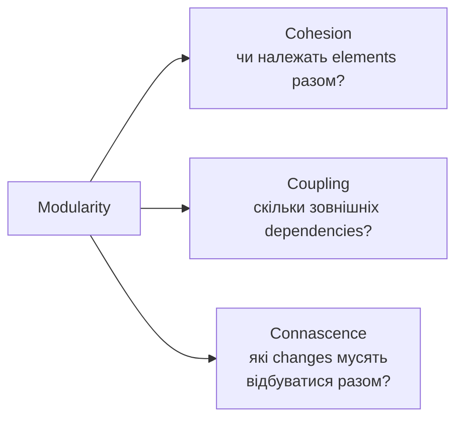

# Chapter 3 - Modularity

← [[02 - Architectural Thinking|← Chapter 2]] | [[00 - Index|Index]] | [[04 - Glossary and Formulas|Glossary →]]

> [!summary] Суть
> Хороша modularity - це правильні boundaries, висока cohesion усередині модулів і слабкий, контрольований coupling між ними. Більше частин не означає кращу архітектуру.

Джерело: [[dokumen_pub_fundamentals_of_software_architecture_a_modern_engineering.pdf]], сторінки книги 37-54.

## Modularity vs Granularity

| Термін | Головне питання |
|---|---|
| **Modularity** | На які логічно пов'язані частини розбити систему? |
| **Granularity** | Якого розміру має бути кожна частина? |

> "Embrace modularity, but beware of granularity."  
> - Mark Richards, p. 38

Надто дрібна granularity збільшує кількість взаємодій і може створити **Distributed Monolith** або **Big Ball of Distributed Mud**.

**Module** - логічна група пов'язаного коду: classes, functions, package або namespace. Логічне групування не обов'язково означає окремий deployment.

## Як оцінювати modularity

## Cohesion

**Cohesion** - ступінь спорідненості частин усередині module. Поділ cohesive module може лише збільшити coupling і погіршити readability.

Від найкращої до найгіршої:

| Вид | Суть |
|---|---|
| **Functional** | Усе потрібне для однієї чіткої функції |
| **Sequential** | Output однієї частини є input іншої |
| **Communicational** | Частини працюють зі спільними даними або результатом |
| **Procedural** | Пов'язані порядком виконання |
| **Temporal** | Пов'язані часом виконання, наприклад startup |
| **Logical** | Схожа категорія, але різні функції, наприклад `StringUtils` |
| **Coincidental** | Випадково опинилися в одному module |

### LCOM - Lack of Cohesion in Methods

LCOM шукає групи methods, які майже не використовують спільні fields:

- низький LCOM -> cohesion переважно вища;
- високий LCOM -> class може містити незалежні responsibilities і бути кандидатом на split;
- LCOM бачить структуру, але не розуміє domain meaning.

![[Assets/FOSA/lcom-cohesion.svg]]

*Перемальовано за Figure 3-1: X має спільну структуру взаємодій, Y фактично містить три незалежні пари, Z має змішану cohesion.*

> [!important] Інтерпретація
> Metrics дають сигнал для дослідження, а не автоматичний verdict. Вони не відрізняють **essential complexity** домену від **accidental complexity** реалізації.

## Coupling

- **Afferent coupling (`Ca`)** - incoming dependencies: скільки artifacts залежать від модуля.
- **Efferent coupling (`Ce`)** - outgoing dependencies: від скількох artifacts залежить модуль.

Мнемоніка: `efferent` -> `exit` -> outgoing.

### Core metrics

**Abstractness**:

$$
A = \frac{m_a}{m_c + m_a}
$$

`A = 0` - лише concrete code; `A = 1` - лише abstractions.

**Instability**:

$$
I = \frac{C_e}{C_e + C_a}
$$

`I = 0` - максимально stable; `I = 1` - максимально unstable.

**Distance from the Main Sequence**:

$$
D = |A + I - 1|
$$

- `D` близько до `0` -> кращий баланс abstraction та instability;
- низькі `A` і `I` -> **Zone of Pain**: concrete і stable, зміни дорогі;
- високі `A` і `I` -> **Zone of Uselessness**: abstractions нестабільні й мало корисні.

![[Assets/FOSA/main-sequence.svg]]

*Об'єднане відтворення Figures 3-2, 3-3 і 3-4: біла лінія - Main Sequence, а `D` - відстань module від неї.*

## Connascence

Два components мають **connascence**, якщо change одного вимагає change іншого для збереження коректності системи.

### Static connascence

| Вид | Components мають погодити |
|---|---|
| **Name** | Назву entity або method |
| **Type** | Тип параметра чи значення |
| **Meaning / Convention** | Значення constants або magic values |
| **Position** | Порядок параметрів |
| **Algorithm** | Однаковий algorithm, наприклад hashing |

### Dynamic connascence

| Вид | Залежність |
|---|---|
| **Execution** | Порядок викликів |
| **Timing** | Синхронність або правильний момент; race conditions |
| **Values** | Значення змінюються разом; transactions |
| **Identity** | Components використовують той самий instance/entity |

Від слабших до сильніших форм:

![[Assets/FOSA/connascence-strength.svg]]

*Перемальовано за Figure 3-5: напрям стрілки показує бажаний refactoring від сильніших dynamic forms до слабших static forms.*

### Як зменшувати connascence

- **Strength** - перетворюй сильні форми на слабші.
- **Locality** - чим далі elements, тим слабшим має бути зв'язок.
- **Degree** - зменшуй кількість elements, які потрібно змінювати разом.
- Мінімізуй connascence, що перетинає module boundaries.
- Усередині encapsulation boundary сильніший зв'язок менш небезпечний.

Приклад: magic value (**Meaning**) замінити на named constant (**Name**).

## Самоперевірка

1. Чим modularity відрізняється від granularity?
2. Яка форма cohesion є найкращою, а яка найгіршою?
3. Що означають `Ca` і `Ce`?
4. Що показують `A`, `I` та `D`?
5. Чим static connascence відрізняється від dynamic?
6. Як locality впливає на припустиму strength зв'язку?

← [[02 - Architectural Thinking|← Chapter 2]] | [[00 - Index|Index]] | [[04 - Glossary and Formulas|Glossary →]]
