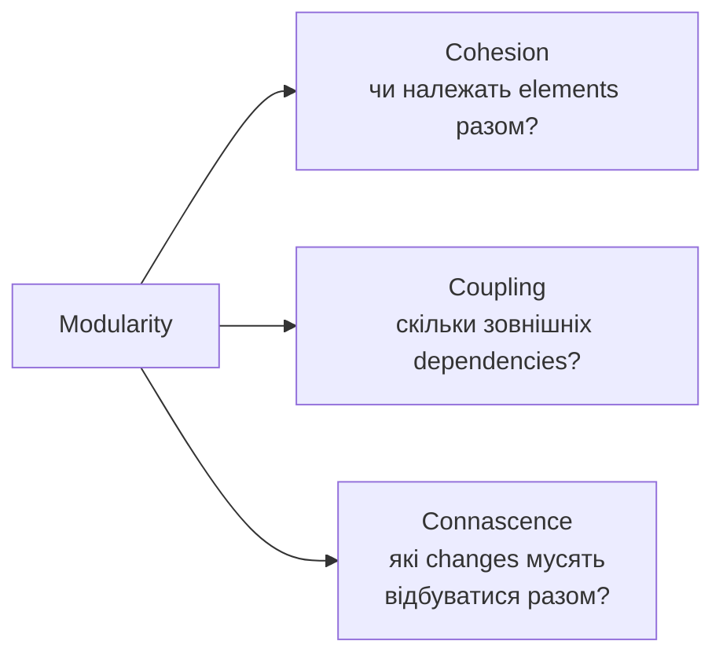

# Chapter 3 - Modularity

← [[02 - Architectural Thinking|← Chapter 2]] | [[00 - Index|Index]] | [[04 - Glossary and Formulas|Glossary →]]

> [!summary] Суть
> Хороша modularity - це правильні boundaries, висока cohesion усередині модулів і слабкий, контрольований coupling між ними. Більше частин не означає кращу архітектуру.

Джерело: [[dokumen_pub_fundamentals_of_software_architecture_a_modern_engineering.pdf]], сторінки книги 37-54.

## Modularity vs Granularity

| Термін | Головне питання |
|---|---|
| **Modularity** | На які логічно пов'язані частини розбити систему? |
| **Granularity** | Якого розміру має бути кожна частина? |

> "Embrace modularity, but beware of granularity."  
> - Mark Richards, p. 38

Надто дрібна granularity збільшує кількість взаємодій і може створити **Distributed Monolith** або **Big Ball of Distributed Mud**.

**Module** - логічна група пов'язаного коду: classes, functions, package або namespace. Логічне групування не обов'язково означає окремий deployment.

> [!example] Де поділ стає надмірним
> У навчальному прикладі `Orders` містить розрахунок суми, застосування знижки та перевірку замовлення. Якщо винести кожну з цих операцій в окремий сервіс, оформлення вимагатиме кількох мережевих викликів і передачі тих самих даних. Коду в кожному сервісі менше, але взаємних залежностей більше. Залишити операції окремими функціями всередині одного модуля може бути простіше.

## Як оцінювати modularity

## Cohesion

**Cohesion** - ступінь спорідненості частин усередині module. Поділ cohesive module може лише збільшити coupling і погіршити readability.

Від найкращої до найгіршої:

| Вид | Суть |
|---|---|
| **Functional** | Усе потрібне для однієї чіткої функції |
| **Sequential** | Output однієї частини є input іншої |
| **Communicational** | Частини працюють зі спільними даними або результатом |
| **Procedural** | Пов'язані порядком виконання |
| **Temporal** | Пов'язані часом виконання, наприклад startup |
| **Logical** | Схожа категорія, але різні функції, наприклад `StringUtils` |
| **Coincidental** | Випадково опинилися в одному module |

**Приклад межі:** `Customer` відповідає за профіль і контактні дані, `Orders` - за склад і статус замовлення. Те, що обидва використовують `customerId`, ще не причина об'єднувати їх. Але якщо розділення змушує постійно передавати внутрішній стан клієнта туди й назад, межу потрібно переглянути. Висока cohesion означає спільну відповідальність, а не просто спільне слово в назві.

### LCOM - Lack of Cohesion in Methods

LCOM шукає групи methods, які майже не використовують спільні fields:

- низький LCOM -> cohesion переважно вища;
- високий LCOM -> class може містити незалежні responsibilities і бути кандидатом на split;
- LCOM бачить структуру, але не розуміє domain meaning.

Наприклад, `CustomerReport` має чотири методи: два змінюють `name/email`, ще два - `rows/columns`. Якщо між цими групами немає спільного стану, клас підозріло поєднує профіль клієнта й побудову звіту. Розглядаємо `CustomerProfile` та `ReportBuilder` як окремі відповідальності. Покроковий розрахунок для такого випадку є в [[04 - Glossary and Formulas#LCOM1 - підрахунок пар методів|прикладі LCOM1]].

![[Assets/FOSA/lcom-cohesion.svg]]

*Перемальовано за Figure 3-1: X має спільну структуру взаємодій, Y фактично містить три незалежні пари, Z має змішану cohesion.*

> [!important] Інтерпретація
> Metrics дають сигнал для дослідження, а не автоматичний verdict. Вони не відрізняють **essential complexity** домену від **accidental complexity** реалізації.

## Coupling

- **Afferent coupling (`Ca`)** - incoming dependencies: скільки artifacts залежать від модуля.
- **Efferent coupling (`Ce`)** - outgoing dependencies: від скількох artifacts залежить модуль.

Мнемоніка: `efferent` -> `exit` -> outgoing.

Наприклад, `Checkout` і `Admin` залежать від `Orders`, а `Orders` - від `Payments`, `Inventory` та `Notifications`. На **рівні модулів** це дає `Ca = 2`, `Ce = 3`. Стрілку залежності читаємо як «використовує», навіть якщо дані повертаються у протилежний бік.

Кілька викликів одного модуля не обов'язково означають кілька окремих залежностей: потрібно зафіксувати одиницю підрахунку. У класичних package metrics рахують залежні класи; у нашому спрощеному прикладі - модулі. Результати різних рівнів не порівнюємо напряму.

### Core metrics

**Abstractness**:

$$
A = \frac{m_a}{m_c + m_a}
$$

`A = 0` - лише concrete code; `A = 1` - лише abstractions.

$m_a$ - кількість interfaces і abstract classes, $m_c$ - кількість concrete classes у вибраному модулі. Якщо є два interfaces і вісім реалізацій, `A = 2 / (2 + 8) = 0.2`. Отже, 20% типів абстрактні. Це не частка рядків коду і не відсоток «якості»: додавати interfaces тільки заради високого `A` немає сенсу.

**Instability**:

$$
I = \frac{C_e}{C_e + C_a}
$$

`I = 0` - максимально stable; `I = 1` - максимально unstable.

Для `Orders` вище `I = 3 / (3 + 2) = 0.6`. Зовнішні зміни в трьох залежностях можуть змусити адаптувати цей модуль; водночас зміна його API зачепить двох споживачів.

> [!important] Stable не означає «без багів»
> Тут stability - структурний опір змінам. Модуль, від якого залежать багато інших, важко змінювати без наслідків для них. Instability не вимірює частоту падінь, runtime reliability або ймовірність збою. `I = 0.6` не означає 60% ризику поломки.

**Distance from the Main Sequence**:

$$
D = |A + I - 1|
$$

- `D` близько до `0` -> ближче до Main Sequence, але це не гарантує хорошої архітектури;
- низькі `A` і `I` -> **Zone of Pain**: concrete і stable, зміни дорогі;
- високі `A` і `I` -> **Zone of Uselessness**: abstractions нестабільні й мало корисні.

Для прикладу з `A = 0.2` та `I = 0.6`: `D = |0.2 + 0.6 - 1| = 0.2`. Вертикальні риски означають **модуль числа**: беремо величину відхилення без знака. Лінія `A + I = 1` поєднує два допустимі полюси: стабільні абстракції `(A=1, I=0)` та конкретну реалізацію, яку легше змінювати `(A=0, I=1)`.

У нотатках `D` позначає **normalized distance** з діапазоном `[0, 1]`. Геометрична відстань до лінії у координатах `(I, A)` дорівнює `D / √2`; у літературі нормовану метрику також позначають `D′`. [Уточнення позначень: Robert C. Martin, pp. 31-33](https://objectmentor.com/resources/articles/Principles_and_Patterns.pdf#page=31).

Наприклад, клас із незмінними математичними функціями може бути concrete і мати багато споживачів. Формально він близько до **Zone of Pain**, але якщо його поведінка майже не змінюється, реальної проблеми може не бути. Спершу перевіряємо характер змін, потім вирішуємо, чи потрібен refactoring.

![[Assets/FOSA/main-sequence.svg]]

*Об'єднане відтворення Figures 3-2, 3-3 і 3-4: біла лінія - Main Sequence, а `D` - відстань module від неї.*

Повний розбір змінних, крайових випадків і вправа з відповіддю: [[04 - Glossary and Formulas#Формули Chapter 3|Glossary and Formulas]].

## Connascence

Два components мають **connascence**, якщо change одного вимагає change іншого для збереження коректності системи.

### Static connascence

| Вид | Components мають погодити |
|---|---|
| **Name** | Назву entity або method |
| **Type** | Тип параметра чи значення |
| **Meaning / Convention** | Значення constants або magic values |
| **Position** | Порядок параметрів |
| **Algorithm** | Однаковий algorithm, наприклад hashing |

### Dynamic connascence

| Вид | Залежність |
|---|---|
| **Execution** | Порядок викликів |
| **Timing** | Синхронність або правильний момент; race conditions |
| **Values** | Значення змінюються разом; transactions |
| **Identity** | Components використовують той самий instance/entity |

Від слабших до сильніших форм:

![[Assets/FOSA/connascence-strength.svg]]

*Перемальовано за Figure 3-5: напрям стрілки показує бажаний refactoring від сильніших dynamic forms до слабших static forms.*

### Як зменшувати connascence

- **Strength** - перетворюй сильні форми на слабші.
- **Locality** - чим далі elements, тим слабшим має бути зв'язок.
- **Degree** - зменшуй кількість elements, які потрібно змінювати разом.
- Мінімізуй connascence, що перетинає module boundaries.
- Усередині encapsulation boundary сильніший зв'язок менш небезпечний.

Приклад: magic value (**Meaning**) замінити на named constant (**Name**).

### Приклади, за якими легко впізнати connascence

| Вид | Навчальний приклад | Що це пояснює |
|---|---|---|
| **Meaning** | `if (status == 3)` | Усі мають пам'ятати, що `3` означає `PAID`. Named constant робить домовленість явною |
| **Position** | `bookSeat("14D", "Olena")` замість `bookSeat("Olena", "14D")` | Два рядки мають правильні типи, але переплутаний зміст. Іменовані поля `{name, seat}` зменшують залежність від порядку |
| **Execution** | `email.send()` перед `email.setRecipient(...)` | Коректність залежить від послідовності. Обов'язкові дані в constructor допомагають уникнути неповного об'єкта |
| **Timing** | Два запити одночасно бачать останнє місце як вільне | Перевірка й бронювання потребують координації, а не просто правильного порядку рядків коду |
| **Values** | Переказ змінює два баланси | Пов'язані значення повинні зберігати спільний інваріант; часткове оновлення його порушує |
| **Identity** | Два компоненти мають оновлювати той самий об'єкт сесії | Дві окремі копії з однаковими полями можуть не забезпечити потрібну поведінку |

Заміна `3` на `PAID` покращує читабельність, але не скасовує спільний контракт між сервісами. **Locality** пояснює різницю: змінити два методи в одному класі зазвичай простіше, ніж узгодити зміну п'яти незалежно розгорнутих сервісів. Такі приклади показують, чому strength, locality та degree потрібно оцінювати разом.

## Самоперевірка

1. Чим modularity відрізняється від granularity?
2. Яка форма cohesion є найкращою, а яка найгіршою?
3. Що означають `Ca` і `Ce`?
4. Що показують `A`, `I` та `D`?
5. Чим static connascence відрізняється від dynamic?
6. Як locality впливає на припустиму strength зв'язку?

← [[02 - Architectural Thinking|← Chapter 2]] | [[00 - Index|Index]] | [[04 - Glossary and Formulas|Glossary →]]
